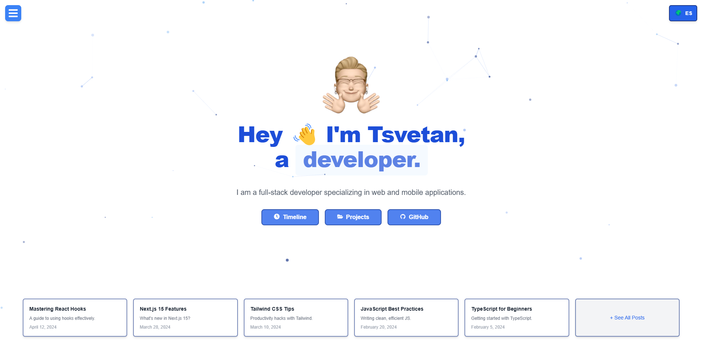

# 🚀 tsvetan.dev

<div align="center">

<a target="_blank" href="https://nuro.dev">
    
</a>

</div>

## 🗂️ English

### 🛠 Development

Clone the repository:

```bash
git clone https://github.com/tsvetanml/tsvetan.dev.git
```

Install dependencies:

```bash
npm install
# Or using Yarn
yarn install
```

Start the development server:

```bash
npm run dev
# Or using Yarn
yarn dev
```

Build for production:

```bash
npm run build
# Or using Yarn
yarn build
```

### 🌍 Deployment

Deploy the project easily using [Vercel](https://vercel.com/):

```bash
vercel deploy
```

Or refer to the [Next.js Deployment Documentation](https://nextjs.org/docs/app/building-your-application/deploying) for more details.

### 🎨 Design

The design of this project is inspired by [NuroDev's repository](https://github.com/NuroDev/nuro.dev).

---

## 🇪🇸 Español

### 🛠 Desarrollo

Clona el repositorio:

```bash
git clone https://github.com/tsvetanml/tsvetan.dev.git
```

Instala las dependencias:

```bash
npm install
# O usando Yarn
yarn
```

Inicia el servidor de desarrollo:

```bash
npm run dev
# O usando Yarn
yarn dev
```

Construye para producción:

```bash
npm run build
# O usando Yarn
yarn build
```

### 🌍 Despliegue

Despliega el proyecto fácilmente usando [Vercel](https://vercel.com/):

```bash
vercel deploy
```

O consulta la [documentación de despliegue de Next.js](https://nextjs.org/docs/app/building-your-application/deploying) para más detalles.

### 🎨 Diseño

El diseño de este proyecto está inspirado en el repositorio de [NuroDev](https://github.com/NuroDev/nuro.dev).
